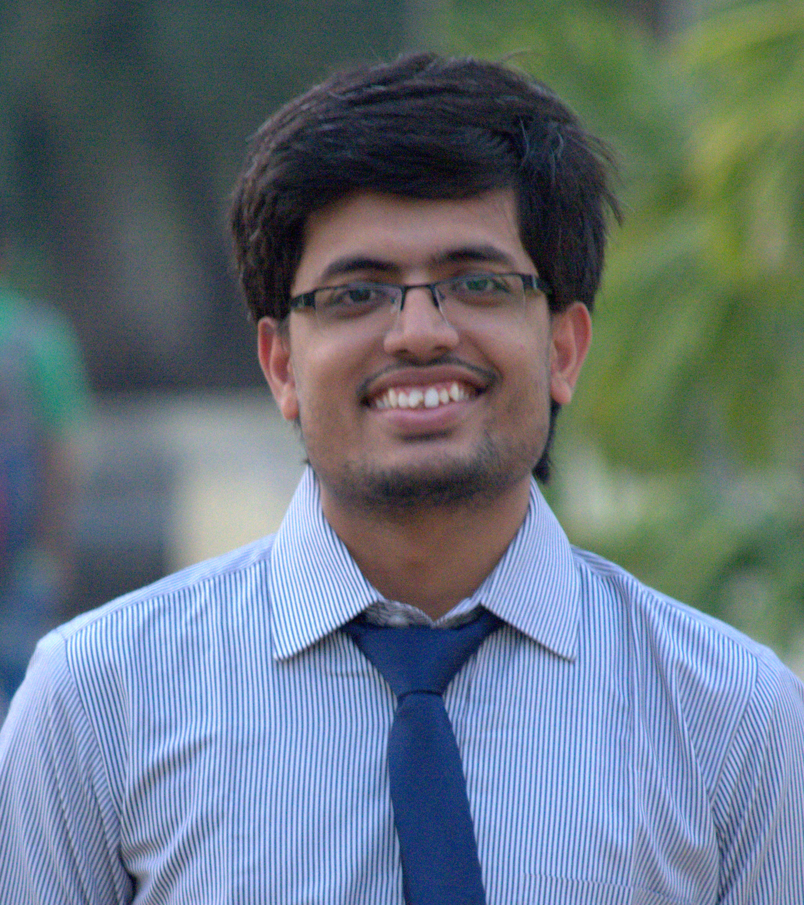

## About Me

Hi! I am a Computer Science Master's student (2019-2021) at Stanford University. I am interested in machine learning, specifically in the field of natural language processing and graph representation learning. I currently work part-time in Prof. Jure's SNAP lab as a research assistant on using graph representation learning and NLP to improve clinical trial safety and efficacy. I am also interested in multiligual NLP escpecially for low resource languages and multimodal deep learning.

I have a B.Tech (Hons.) in Computer Science and Engineering from Indian Institute of Technology, Kharagpur and have worked at Goldman Sachs Bangalore as an analyst for two year prior to joining the master's program at Stanford.
 

## Research Interests

Machine Learning, Natural Language Processing, Graph Representation Learning

## Publications

* **Agarwal, P.**, Sharma, A., Grover, J., Sikka, M., Rudra, K. and Choudhury, M., 2017, January. I may talk in English but gaali toh Hindi mein hi denge: A study of English-Hindi code-switching and swearing pattern on social networks. In Communication Systems and Networks (COMSNETS), 2017 9th International Conference on (pp. 554-557). IEEE.

## Awards and Achievements

* Received **Bigyan Sinha Memorial Endowment Prize** for being the second best student in order of merit in the graduating B.Tech (Hons.) batch of 2017, IIT Kharagpur

* Received **Institute Silver Medal** for being the best student in order of merit among the graduating B.Tech (Hons.) degree in Computer Science and Engineering in 2017

* Won **bronze medal in Opensoft (inter hostel tech competition), 2017** for developing a distributed web-based photo-sharing app using blockchain

* Received **J.C. Ghosh Memorial Endowment Prize** for securing highest CGPA in the department at the end of 6th semester

* Secured **1st position** in a team of 4 in event **Code-O-Shuffle** (online programming competition) in Kshitij (annual techno-management fest), IIT Kharagpur, 2016

* Received **Goralal Syngal Memorial Scholarship** for securing 2nd highest CGPA at the end of 4th semester among the students of the department of CSE, ECE, and EE

* Received **Sachinandan Basak Memorial Endowment Prize** for best National Social Service (program aimed at developing rural areas near institutes) volunteer student of the year 2014-15 among 400 students
